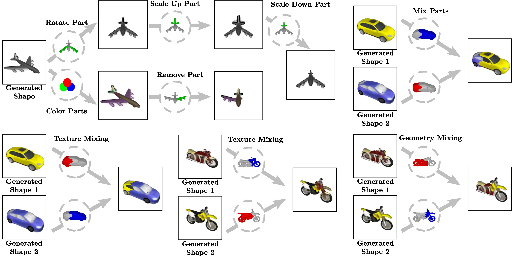

# PartNeRF: Generating Part-Aware Editable 3D Shapes without 3D Supervision

This repository contains the code that accompanies our CVPR 2023 paper [Generating Part-Aware Editable 3D Shapes without 3D Supervision](https://ktertikas.github.io/part_nerf).



Table of contents:
- [Installation](#installation)
  1. [Setup The Environment](#1-setup-the-environment)
  2. [Compile Extensions](#2-compile-extensions)
  3. [Install Package](#3-install-package)
- [Dataset Preparation](#dataset-preparation)
  - [ShapeNet](#shapenet)
  - [Lego Tractor](#lego-tractor)
- [Training](#training)
- [Pretrained Models](#pretrained-models)
- [Shape Generation](#shape-generation)
- [Inference](#inference)
- [Shape Mixing](#shape-mixing)
- [Interpolation](#interpolation)
- [Part Editing](#part-editing)
- [Citation](#citation)

# Installation
Our codebase has the following python dependencies:
- [numpy](https://numpy.org/doc/stable/user/install.html)
- [cython](https://cython.readthedocs.io/en/latest/src/quickstart/build.html)
- [torch && torchvision](https://pytorch.org/get-started/locally/)
- [trimesh](https://github.com/mikedh/trimesh)
- [Pillow](https://python-pillow.org/)
- [pandas](https://pandas.pydata.org/)
- [OmegaConf](https://omegaconf.readthedocs.io/)

Some dependencies that enable a better experience during training:
- [wandb](https://docs.wandb.ai/quickstart), for logging the experiments.
- [simple-3dviz](https://simple-3dviz.com), an awesome visualization library!

Note that if running on a headless machine a virtual display package needs to be installed, such as `xvfb`!

## 1. Setup The Environment
The simplest way to make sure that you have all dependencies in place is to use [conda](https://docs.conda.io/projects/conda/en/4.6.1/index.html) or [docker](https://www.docker.com/).

### Docker
A prebuilt docker container that has all required dependencies can be downloaded directly from the github container registry via
```bash
docker pull ghcr.io/ktertikas/part_nerf:latest
```
You can also build your own docker container that has all required dependencies using the following command:
```bash
docker build -f docker/Dockerfile.gpu --build-arg CUDA_VERSION=11.2.1 --build-arg UBUNTU_VERSION=18.04 --build-arg PYTHON_VERSION=3.8 --tag part_nerf:latest .
```
You can then step inside a docker image with the following command:
```bash
docker run -it --mount source=${CODE_PATH},target=/code,type=bind --gpus all part_nerf:latest
```
Note theat the docker image does not contain the repository files, only the dependencies needed, so a docker mount of the codebase is needed, as shown above!

### Conda
If you prefer conda instead, you can use the `environment.yml` file to create a new conda environment named `part_nerf` as such:
```bash
conda env create --file environment.yml
```
You can then activate it running
```bash
conda activate part_nerf
```

## 2. Compile Extensions
The next step that needs to happen is to compile the required extension modules. You can do this inside the docker environment by mounting the `part_nerf` repository using volumes (an example is shown in the `docker run` command above). The command to compile the extension modules in any environment is the following:
```bash
python setup.py build_ext --inplace
```

## 3. Install Package
You can now install the `part_nerf` package in editable mode using pip:
```bash
pip install -e .
```

# Dataset Preparation
## ShapeNet
We render the ShapeNet dataset images and 2D masks using the [simple-3dviz](https://simple-3dviz.com) library. In order to do the rendering on your own, you can use the script that we provide. Note that you first need to download the [ShapeNetCore.v1](https://shapenet.org/) dataset. After downloading and extracting the dataset, you can run the following command to generate masks, images, and cameras for the `airplanes, cars, motorbikes` categories:
```bash
conda activate part_nerf # Or use docker run -it ... if you prefer docker
python scripts/render_shapenet.py [PATH_TO_SHAPENET_CATEGORY] --num_cpus [SELECTED_NUMBER_OF_CPUS]
```
For the `chairs, tables` classes you need to render the objects from a slightly bigger distance, so the above command becomes as follows:
```bash
python scripts/render_shapenet.py [PATH_TO_SHAPENET_CATEGORY] --num_cpus [SELECTED_NUMBER_OF_CPUS] --camera_distance 1.8
```
## Lego Tractor
We provide the original NeRF dataset for the Lego Tractor, accompanied with the modified camera pose assumptions / files. You can download the dataset from [this link](https://drive.google.com/drive/folders/1ySSR9Am1pFEdb8-gyxEIKQGN6yRmFh4O?usp=sharing).

# Training
After installation of the required packages, we are ready to train our model! We show the training script for the `airplanes` category
### Computer with Display:
```bash
cd [PATH_TO_REPOSITORY]/scripts
python train_partnerf.py config="../conf/partnerf_airplanes.yaml"
```
### Headless Server:
```bash
cd [PATH_TO_REPOSITORY]/scripts
xvfb-run -a python train_partnerf.py config="../conf/partnerf_airplanes.yaml"
```
The above commands train our default model on the `airplanes` category. The `conf/` folder contains mode configuration files for the other ShapeNet categories. Keep in mind that you may need to modify the `dataset_directory` option of the configuration file to adapt it to your custom path!

Note that training with the default configurations requires a single **GPU** with **24GB** memory. In case you have a smaller GPU, you can reduce the batch size as follows:
```bash
python train_partnerf.py config="../conf/partnerf_airplanes.yaml" train.batch_size=[NEW_BATCH_SIZE] 
```
### Training Configurations
Our configurations are based on the [OmegaConf](https://omegaconf.readthedocs.io/) library. In particular, we combine the functionality of OmegaConf with python `dataclasses` for extra config type checking. All the training config options are defined as a dataclass [here](https://github.com/ktertikas/part_nerf/blob/main/scripts/autodecoder_definitions.py#L119).

Modifying the config options via command line is easy. For example, accessing and modifying the **batch size**, the **number of epochs** and the **optimizer type** can be done as follows:
```bash
python train_partnerf.py config="../conf/partnerf_airplanes.yaml" train.batch_size=[NEW_BATCH_SIZE] trainer.num_epochs=[NEW_NUM_EPOCHS] optimizer.type=[NEW_OPTIMIZER_TYPE]
```

# Pretrained Models
We provide a list of pretrained configurations for the `airplanes, cars, motorbikes, chairs, tables` categories. You can download the pretrained models from [this link](https://drive.google.com/drive/folders/1QpZk7j7BrDLbawua91OrURcZtvllfyZp?usp=sharing).

# Shape Generation

To generate 100 new shapes after having trained a specific category model, you can do the following:

```bash
cd [PATH_TO_REPOSITORY]/scripts
python shape_generation.py conf/partnerf_airplanes_model.yaml --checkpoint_path [PATH_TO_SAVED_CHECKPOINT] --num_generations 100 --with_renders
```
This command generates both full meshes and part meshes, as well as a single rendered image. Please run
```bash
cd [PATH_TO_REPOSITORY]/scripts
python shape_generation.py --help
```
to check the other options.

# Inference
We provide a script that can run inference on the pretrained per-instance latent codes, or can infer the generated shapes.
### Pretrained Per-Instance Latents
```bash
cd [PATH_TO_REPOSITORY]/scripts
python inference.py conf/partnerf_airplanes_model.yaml --checkpoint_path [PATH_TO_SAVED_CHECKPOINT] --embedding_ids 0 1 2 3 4
```
### Generated Shapes
```bash
cd [PATH_TO_REPOSITORY]/scripts
python inference.py conf/partnerf_airplanes_model.yaml --checkpoint_path [PATH_TO_SAVED_CHECKPOINT] --embedding_ids 0 1 2 3 4 --latent_path [PATH_TO_GENERATION_LATENT_PATH]
```
Note that this requires running the shape generation processs first, in order to generate the appropriate latent codes per shape (these are saved by default).


# Shape Mixing

We provide a script that can run mixing operations between two different shapes, either generated or from existing trained shapes. You can run the following script for that:
```bash
cd [PATH_TO_REPOSITORY]/scripts
python part_mixing.py conf/partnerf_airplanes_model.yaml --checkpoint_path [PATH_TO_SAVED_CHECKPOINT] --part_ids_1 0 2 3 12 15 --part_ids_2 1 4 5 6 7 8 9 10 11 13 14 --embedding_id_1 10 --embedding_id_2 21 --latent_path_1 [PATH_TO_GENERATION_LATENT_PATH1] --latent_path_2 [PATH_TO_GENERATION_LATENT_PATH2]
```
The above command will perform all the shape mixing variants (`texture mixing, geometry mixing, combined mixing`) as discussed in the paper experiments, combining the parts 0,2,3,12,15 of generated shape #10, with the parts 1,4,5,6,7,8,9,10,11,13,14 of generated shape #21.


# Interpolation
We provide scripts for **shape interpolation** and **part interpolation** between two different shapes.
### Shape Interpolation

```bash
cd [PATH_TO_REPOSITORY]/scripts
python shape_interpolation.py conf/partnerf_airplanes_model.yaml --checkpoint_path [PATH_TO_SAVED_CHECKPOINT] --embedding_id_1 12 --embedding_id_2 13 
```

### Part Interpolation

```bash
cd [PATH_TO_REPOSITORY]/scripts
python part_interpolation.py conf/partnerf_airplanes_model.yaml --checkpoint_path [PATH_TO_SAVED_CHECKPOINT] --part_ids 0 2 3 --embedding_id_1 12 --embedding_id_2 13 
```
For more options please use the `--help` flag in each command!


# Part Editing


Our method allows editing on the part level. A user can do this with the following command:
```bash
cd [PATH_TO_REPOSITORY]/scripts
python part_editing.py conf/partnerf_airplanes_model.yaml --part_ids 0 2 --embedding_id 10 --translation 0.0 0.2 0.0 --rotation_axis 1. 0. 0. --rotation_angle 30
```
The above command selects the parts with ids 0, 2 of the pretrained shape #10, rotates the parts 30 degrees along the x axis, and moves them 0.2 in the y direction.


# Citation
If you found our work influential or helpful for your research, please consider citing
```
@inproceedings{Tertikas2023CVPR,
  author = {Tertikas, Konstantinos and Paschalidou, Despoina and Pan, Boxiao and Park, Jeong Joon and Uy, Mikaela Angelina and Emiris, Ioannis and Avrithis, Yannis and Guibas, Leonidas},
  title = {Generating Part-Aware Editable 3D Shapes without 3D Supervision},
  booktitle = {Proceedings IEEE Conf. on Computer Vision and Pattern Recognition (CVPR)},
  year = {2023}
}
```
